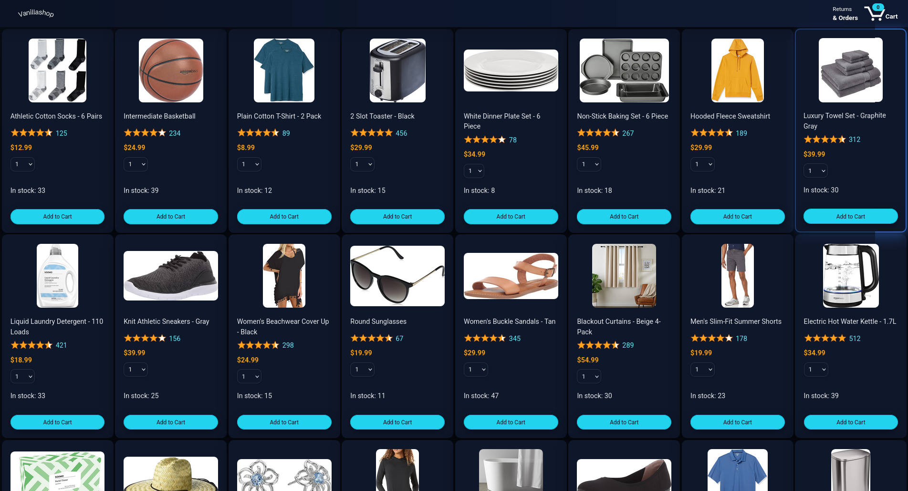
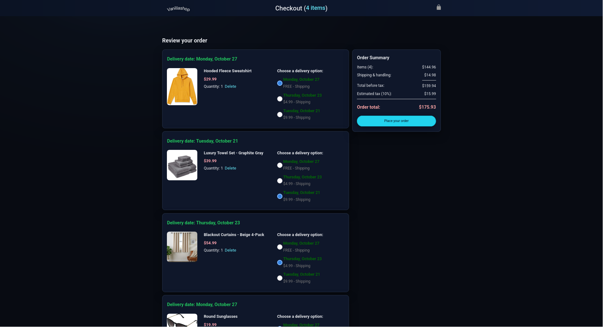
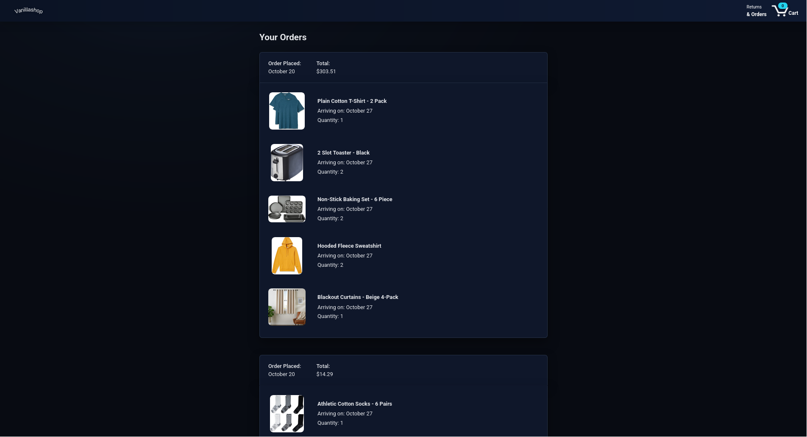

# 🛒 VanillaShop

<div align="center">

**A modern, responsive e-commerce platform built with vanilla JavaScript**

*Clean, professional storefront with full shopping cart functionality and order management*

*Uses Day.js library for date formatting and manipulation*

[](https://developer.mozilla.org/en-US/docs/Web/HTML)
[](https://developer.mozilla.org/en-US/docs/Web/CSS)
[](https://developer.mozilla.org/en-US/docs/Web/JavaScript)
[](https://day.js.org/)
[](https://opensource.org/licenses/MIT)

</div>


---

## 🌐 Live Demo

Experience VanillaShop instantly without any setup or installation:

<div align="center">

### Experience VanillaShop in Action

No installation required • No setup needed • Just click and explore

**🚀 [Launch Live Demo →](https://sbibers.github.io/VanillaShop/)**

</div>

---


## 📸 Screenshots

<div align="center">

### 🏠 Product Catalog


### 🛒 Checkout Process


### 📋 Order History


</div>

---

## ✨ Features

### 🛍️ **Core E-Commerce Functionality**
- **Product Catalog** — Browse items with high-quality images, pricing, and real-time stock levels
- **Shopping Cart** — Add/remove items, adjust quantities, and view running totals
- **Order Management** — Complete checkout process with order confirmation and history tracking
- **Inventory System** — Real-time stock tracking with overselling prevention

### 🎨 **User Experience**
- **Responsive Design** — Seamless experience across desktop, tablet, and mobile devices
- **Dark Theme** — Modern, professional dark UI with carefully chosen color palette
- **Product Details Modal** — Click any product to view comprehensive information
- **Smooth Animations** — Subtle hover effects and transitions for enhanced interactivity

### 💾 **Data Management**
- **Local Storage** — All data persists between browser sessions
- **Client-Side Architecture** — No backend required, runs entirely in the browser
- **Modular Code Structure** — Clean, maintainable JavaScript with ES6+ modules

---

## 🛠️ Technology Stack

| Technology | Purpose | Version |
|------------|---------|---------|
| **HTML5** | Structure & Semantics | Latest |
| **CSS3** | Styling & Layout | Grid, Flexbox, Custom Properties |
| **JavaScript** | Interactivity & Logic | ES6+ Modules |
| **Local Storage** | Data Persistence | Web API |
| **Day.js** | Date Formatting | 1.x (CDN) |

**Note:** Day.js is the only external dependency, loaded via CDN for date manipulation and formatting.

---

## 📁 Project Architecture

```
VanillaShop/
├── 📄 HTML Pages
│   ├── index.html         # Product catalog
│   ├── checkout.html            # Shopping cart & checkout
│   └── orders.html              # Order history
├── 📂 Data Layer
│   ├── products.js              # Product catalog data
│   ├── cart.js                  # Cart management logic
│   ├── orders.js                # Order storage & retrieval
│   └── inventory.js             # Stock management system
├── 📂 Scripts
│   ├── vanillashop.js           # Product display & interactions
│   ├── checkout.js              # Checkout process logic
│   └── orders.js                # Order history display
├── 📂 Styles
│   ├── shared/                  # Global styles & components
│   └── pages/                   # Page-specific styling
└── 📂 Assets
    ├── images/products/         # Product photography
    ├── images/icons/            # UI icons
    └── images/variations/       # Product variations
```

---

## 🚀 Quick Start

### Prerequisites
- Modern web browser (Chrome 60+, Firefox 55+, Safari 12+, Edge 79+)
- Local web server (VS Code Live Server recommended)

### Installation

1. **Clone or download** the project files
2. **Open in VS Code** and install "Live Server" extension
3. **Right-click** on `index.html` → "Open with Live Server"
4. **Navigate** to `http://localhost:5500`

### Alternative Setup
```bash
# Using Python (if installed)
python3 -m http.server 5500
# Open http://localhost:5500
```

---

## 🔄 Application Flow

### 1. **Product Browsing**
- Products load from `data/products.js`
- Real-time inventory checking via `data/inventory.js`
- Interactive product details modal on click
- Items stored in `localStorage` via `data/cart.js`
- Quantity validation against available stock
- Dynamic cart count in header

### 3. **Checkout Process**
- Order summary calculation
- Payment form validation
- Order creation and inventory updates

### 4. **Order Management**
- Orders saved to `localStorage`
- Order history display on `orders.html`
- Persistent data across sessions

---

## 🎯 Key Interactions

| Action | Description | Location |
|--------|-------------|----------|
| **🛒 Add to Cart** | Click "Add to Cart" button | Product cards |
| **👁️ View Details** | Click product image/name | Product cards |
| **🛍️ View Cart** | Click cart icon in header | All pages |
| **💳 Place Order** | Complete checkout form | Checkout page |
| **📋 View Orders** | Navigate to orders page | Header navigation |
| **📦 Track Stock** | Real-time inventory display | Product cards |

---

## 🎨 Customization Guide

### **Adding Products**
```javascript
// In data/products.js
{
  id: 'unique-id',
  name: 'Product Name',
  price: 29.99,
  image: 'images/products/product.jpg',
  stock: 25
}
```

### **Styling Modifications**
- **Colors**: Update CSS custom properties in `styles/shared/general.css`
- **Layout**: Modify grid/flexbox properties in page-specific CSS files
- **Typography**: Adjust font families and sizes in `general.css`

### **Feature Extensions**
- **Payment Integration**: Add payment gateway APIs to checkout process
- **User Authentication**: Implement login/logout functionality
- **Search**: Add product search and filtering capabilities
- **Reviews**: Create product review and rating system

---

## 📱 Responsive Breakpoints

| Device | Width | Layout |
|--------|-------|--------|
| **Mobile** | < 768px | Single column, stacked layout |
| **Tablet** | 768px - 1024px | 2-column grid, adjusted spacing |
| **Desktop** | > 1024px | 3-column grid, full features |

---

## 🔧 Browser Compatibility

| Browser | Minimum Version | Status |
|---------|----------------|--------|
| **Chrome** | 60+ | ✅ Fully Supported |
| **Firefox** | 55+ | ✅ Fully Supported |
| **Safari** | 12+ | ✅ Fully Supported |
| **Edge** | 79+ | ✅ Fully Supported |

---

## 📄 License

This project is licensed under the **MIT License** - see the [LICENSE](LICENSE) file for details.

**Free for personal and commercial use** - perfect for learning, demos, and portfolio projects.

---

## 🤝 Contributing

Contributions are welcome! Please feel free to submit a Pull Request. For major changes, please open an issue first to discuss what you would like to change.

---

<div align="center">

**Built with ❤️ using vanilla JavaScript**

*No frameworks, no bundlers, no npm – just clean, efficient code with minimal dependencies*

</div>